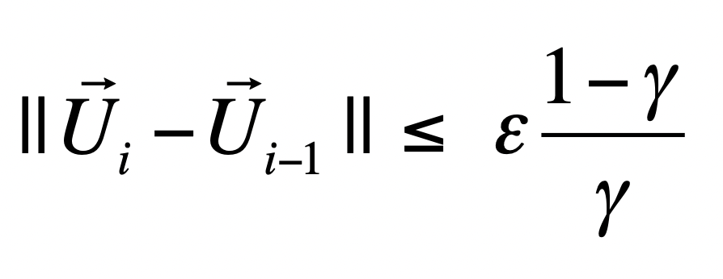

.result {
    width: 200px;
    color: red;

}
# Markov Decision Processes Lab 
### Authors: Caleb Eurich & Conrad Li

## Instructions
These are the parameters to run:
   1. Discount factor
   2. Maximum state error
   3. Positive terminal state reward
   4. Negative terminal state reward
   5. Non-terminal state reward
   6. Step cost
    
Instruction code: `java SmallGrid 0.1 1e-6 1 -1 0 -0.04`

## Questions
### **Question 1:**

Value Iteration took 22 iterations to solve this problem with a discount factor of 0.99, a maximum state error of 1e-6, a positive terminal state reward of +1, a negative terminal state reward of -1, and a step cost of -0.04. 

### **Question 2:**

It actually takes 4 iterations for the policy to be the same as the optimal policy. 

### **Question 3:**

#### Discount Factor

| Discount Factor | # of Iterations | 
| :-------------: | :-------------: |
|       0.1       |         5       |
|       0.4       |        12       |
|       0.7       |        10       |
|       1.0       |        41       |

**Explanation**

Generally, the number of iterations required for convergence increases as the discount factor increases. The termination condition is when:

<class style="width:200px; height:auto;">

Thus, the termination condition is more easily met when the discount factor is smaller. If the discount factor is not high enough, the potential positive reward will not effectively propagate to affect utilities. 

#### Step Cost
|    Step Cost    | # of Iterations | 
| :-------------: | :-------------: |
| | |
|       -10.0     |        23       |
|       -0.04     |        22       |
|        0.0      |        138      |
|        0.04     |        895      |

**Explanation** 

When the step cost is -10, or too high relative to the positive/negative reward terminal, the agent wants to end up in a terminal state as soon as possible—even the negative reward terminal state. The negative reward terminal state is less costly than the step cost.

With a step cost of -0.04, the agent tries to take a reasonable amount of steps to get to the positive reward. It will take some risk going near the negative reward terminal state because the risk is low.

With no step cost, the agent will take the safest route which is to always go in the direction with 0 probability of ending up in the negative reward terminal state.

With a positive step cost, the agent will do whatever it can to avoid the positive and negative terminal states because it can accumulate  more rewards than terminating.

#### Negative Reward
| Negative Reward | # of Iterations | 
| :-------------: | :-------------: |
| | |
|      -100.0     |       140       |
|      -10.0      |       140       |
|      -1.0       |       22        |

**Explanation**

Big negative reward = bad. Avoid at all cost. 
No, but seriously, really big negative rewards are so bad that the agent would rather run into the wall repeatedly until the 0.1 chance it moves in the incorrect direction kicks in. It will do everything it can to avoid the negative reward terminal state.

#### Positive Reward
| Positive Reward | # of Iterations | 
| :-------------: | :-------------: |
| | |
|       1.0       |        22       |
|      10.0       |        136      |
|     100.0       |        165      |

This was pretty interesting because you'd expect the agent to move toward the reward state as fast as possible. However, it does a similar thing to a large negative reward in which it moves in the direction that has zero probability of moving into the negative terminal reward state. The positive reward is so large relative to the step cost and discount factor that it is worth it to take a longer time to reach it than risk ending up in a negative terminal reward state. 